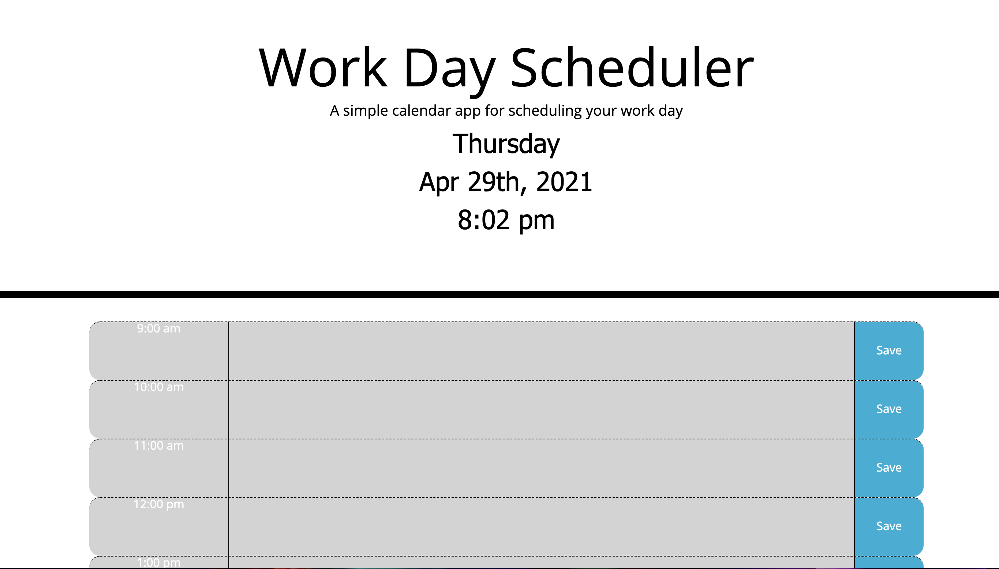
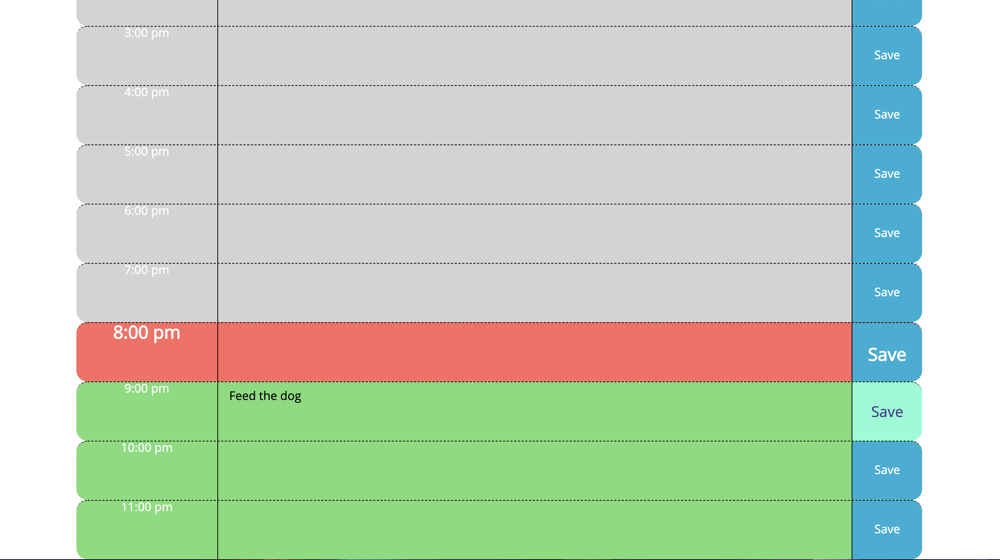

# Work Day Planner

- I was tasked with creating a simple calendar application that allows a user to save events for each hour of the day by modifying the starter code. This app will run in the browser and feature dynamically updated HTML and CSS powered by jQuery.

- When the planner is opened by the user, it displays the current day, date and time at the top of the calendar. 

- When the user scrolls down, they are presented with timeblocks for standard business hours. Each timeblock is color coded to indicate whether it is in the past, present, or future. I created an array for each of the hour timeblocks in the script.js. The varibales created within the JS file were then linked with the appropriate HTML and CSS id's and classes. 

- I added if/else loops to be able to display the stylings for past, present and future events. This enables the browser to indicate past timeframes in grey, present in red and future in green. This is linked using the Moment.js library, allowing the appication to update in real-time for the user. 

- When the user clicks into a timeblock, they are able to enter text for an event in that timeframe. The user then clicks the "save" button for that specific timeblock to save the text for that event in local storage. The "save" button was created outside of the HTML, utilizing the external JS file. There, I used .addClass to add the button to the container. The container class was then called as function to display the "p" tags, textArea and saveBtn as well as to create a method to store the text in local storage.

- The user can then refresh the page and still be presented with their saved events. 

- The [Moment.js] (https://momentjs.com/) library is utilized to work with the date and time. The documentation concentrates on using Moment.js within the browser.

- Deployed link: https://ddaghlas.github.io/Day-Planner/

